# 🚀 배달앱 시스템 아키텍처 - 대량 주문 이벤트 대응 (개발 진행 중)

## 📋 목차

1. [아키텍처-개요](#-아키텍처-개요)
2. [핵심 플로우 상세](#-핵심 플로우 상세)
3. [문제 상황별 해결책](#-문제 상황별 해결책)
4. [핵심 컴포넌트 상세](#-핵심 컴포넌트 상세)

---

## 🎯 아키텍처 개요

[](system-architecture.svg?raw=true)

### 시나리오

> "한 가게에 이벤트로 인해 주문이 대량으로 몰리는 상황"

이 아키텍처는 **초당 수천 건의 주문**이 특정 가게에 집중될 때도 안정적으로 처리할 수 있도록 설계되었습니다.

### 핵심 설계 원칙

| 원칙 | 설명 | 적용 기술 |
|------|------|----------|
| **핫패스 최소화** | 유저 응답에 필수적인 것만 동기 처리 | Outbox 패턴, 비동기 메시징 |
| **읽기/쓰기 분리** | CQRS로 부하 분산 | Replica DB, Elasticsearch |
| **장애 격리** | 외부 시스템 장애 전파 방지 | Circuit Breaker, Timeout |
| **데이터 정합성** | 분산 환경에서 일관성 보장 | SAGA 패턴, 멱등키 |
| **확장성** | 수평 확장 가능한 구조 | 샤딩, Kafka 파티션 |
| **ORM** | 객체-관계 매핑으로 생산성 향상 | Spring Data JPA |

---

## 🔄 핵심 플로우 상세

### 1️⃣ 인증 플로우 (①~③)

```
[Client] → ① 토큰 요청 → [KeyCloak]
[KeyCloak] → ② JWT 발급 → [Client]
[Client] → ③ API 요청 (JWT + 멱등키) → [API Gateway]
```

**KeyCloak 역할:**

- OAuth2/OIDC 기반 인증
- JWT 토큰 발급 및 검증
- 사용자 세션 관리

**포인트:** "클라이언트가 매 요청마다 인증서버를 거치지 않고, JWT를 통해 API Gateway에서 직접 검증합니다."

---

### 2️⃣ Gateway 처리 (④~⑥)

```
[API Gateway] → ④ Rate Limit 체크 → [Rate Limiter]
[API Gateway] → ⑤ 서비스 조회 → [Eureka]
[Eureka] → ⑥ 인스턴스 정보 → [API Gateway]
```

**Rate Limiter 전략:**

```
Token Bucket 알고리즘
├── 사용자별: 100 req/min
├── IP별: 1000 req/min
└── 가게별: 5000 req/min (이벤트 시 동적 조절)
```

**Eureka 서비스 디스커버리:**

- 서비스 인스턴스 자동 등록/해제
- 클라이언트 사이드 로드밸런싱
- Health Check 기반 라우팅

---

### 3️⃣ 주문 핫패스 - 동기 처리 (⑦~⑫)

```
[API Gateway] → ⑦ 주문 요청 → [주문 API]
[주문 API] → ⑧ 캐시 조회 (싱글플라이트) → [Redis], 주문 데이터의 유효성 검증 또는 멱등키 체크
[주문 API] → ⑨ 재고 예약 → [재고 API]
[재고 API] → ⑩ 재고 차감 → [주문 DB], 혹은 [재고 DB]로 분리 가능
[주문 API] → ⑪ 주문 저장 + Outbox → [주문 DB]
[주문 API] → ⑫ PENDING 응답 → [Client]
```

**핫패스(가장 빈번하게 실행되어 성능이 매우 중요한 경로) 설계 핵심 (Spring Data JPA 사용):**

```java
@Transactional  // JPA 트랜잭션 관리
public OrderResponse createOrder(OrderRequest request) {
    // 1. 멱등키 확인 (Redis)
    if (idempotencyService.isDuplicate(request.getIdempotencyKey())) {
        return idempotencyService.getCachedResponse(request.getIdempotencyKey());
    }
    
    // 2. 재고 예약 (동기)
    inventoryService.reserve(request.getItems());
    
    // 3. 주문 저장 + Outbox 기록 (JPA 단일 트랜잭션으로 원자성 보장)
    Order order = orderRepository.save(toOrder(request));  // JpaRepository
    outboxRepository.save(new OutboxEvent("order-created", order));  // JpaRepository
    
    // 4. 즉시 응답 (PENDING 상태)
    return new OrderResponse(order.getId(), OrderStatus.PENDING);
}
```

**응답 시간 목표:** 200ms 이내

---

### 4️⃣ 비동기 처리 - 이벤트 발행 (⑬~⑭)

```
[Outbox Worker] → ⑬ 폴링 → [Outbox 테이블]
[Outbox Worker] → ⑭ 이벤트 발행 → [Kafka]
```

**Outbox 패턴의 장점:**

- DB 트랜잭션과 이벤트 발행의 원자성 보장
- 메시지 유실 방지
- 순서 보장 가능

**Kafka ISR (In-Sync Replicas):**

```yaml
# 최소 2개 복제본에 쓰여야 ACK
min.insync.replicas: 2
acks: all
```

---

### 5️⃣ 비동기 처리 - 결제 (⑮~⑲)

```
[Kafka] → ⑮ order-created 구독 → [결제 API]
[결제 API] → ⑯ 멱등키 확인 → [Redis]
[결제 API] → ⑰ PG 승인 (서킷브레이커) → [PG Gateway]
[PG Gateway] → ⑱ 결제 결과 → [결제 API]
[결제 API] → ⑲ payment-result 발행 → [Kafka], 이때 Redis의 주문 정보를 최신 상태(결제 완료)로 즉시 덮어씌움
```

**Resilience4j 설정:**

```java
@CircuitBreaker(name = "pgPayment", fallbackMethod = "fallbackPayment")
@Retry(name = "pgPayment")
@TimeLimiter(name = "pgPayment")
public PaymentResult processPayment(PaymentRequest request) {
    return pgClient.approve(request);
}

// Fallback: 결제 지연 큐로 이동
public PaymentResult fallbackPayment(PaymentRequest request, Exception e) {
    delayedPaymentQueue.enqueue(request);
    return PaymentResult.PENDING;
}
```

---

### 6️⃣ 비동기 처리 - 알림 (⑳~㉑)

```
[Kafka] → ⑳ 이벤트 구독 → [알림 API]
[알림 API] → ㉑ Push/SMS 발송 → [Client]
```

---

### 7️⃣ SAGA 보상 트랜잭션 (㉒~㉕)

```
[Kafka] → ㉒ payment-failed → [SAGA Coordinator]
[SAGA] → ㉓ 재고 롤백 → [재고 API]
[SAGA] → ㉔ 주문 취소 → [주문 DB]
[SAGA] → ㉕ 보상 완료 이벤트 → [Kafka]
```

**SAGA 상태 머신:**

```
ORDER_CREATED → PAYMENT_PENDING → PAYMENT_COMPLETED → CONFIRMED
                      ↓
              PAYMENT_FAILED → COMPENSATING → CANCELLED
```

---

### 8️⃣ CQRS 읽기 모델 동기화 (㉖~㉛)

```
[Kafka] → ㉖ 이벤트 구독 → [Replica DB], 워커 서비스 또는 Kafka Connector가 처리
[Kafka] → ㉗ 인덱싱 → [Elasticsearch], 워커 서비스 또는 Kafka Connector가 처리

[API Gateway] → ㉘ 조회 요청 → [조회 API]
[조회 API] → ㉙ 캐시 히트 → [Redis], 결제 완료 후 저장되었던 주문 정보를 조회, 읽기 모델 동기화가 늦더라도 Redis에서 최신 상태 조회 가능
[조회 API] → ㉚ 캐시 미스 (키셋 페이징) → [Replica DB]
[조회 API] → ㉛ 검색 쿼리 → [Elasticsearch]
```

**키셋 페이징 (Cursor-based):**

```sql
-- ❌ Offset 페이징 (느림)
SELECT * FROM orders ORDER BY created_at DESC LIMIT 20 OFFSET 10000;

-- ✅ 키셋 페이징 (빠름)
SELECT * FROM orders 
WHERE created_at < '2024-01-15 10:30:00' 
ORDER BY created_at DESC 
LIMIT 20;
```

---

### 9️⃣ 실시간 스트림 파이프라인 (㉜~㉟)

```
[Kafka] → ㉜ 스트림 소비 → [Flink]
[Flink] ↔ [RocksDB State Backend]
[Flink] → ㉝ 집계 데이터 → [Data Warehouse], BigQuery/Snowflake
[Flink] → ㉞ 실시간 메트릭 → [Metrics Store], (일반적) InfluxDB/Prometheus/TimescaleDB, (대용량/고성능 분석용) Apache Druid/Apache Pinot, ClickHouse
[Flink] → ㉟ 이상 탐지 → [Redis] → 알림, 워커 서비스가 Redis를 읽어서 처리하거나 Flink가 알림 서비스에 호출 (알림 폭탄 방지를 위해 중복 체크용으로 Redis 사용)
```

**Flink 처리 예시:**

```java
// 5분 윈도우 주문량 집계
orderStream
    .keyBy(order -> order.getStoreId())
    .window(TumblingEventTimeWindows.of(Time.minutes(5)))
    .aggregate(new OrderCountAggregator())
    .addSink(new MetricsSink());

// 이상 탐지: 평소 대비 10배 이상 주문
orderStream
    .keyBy(order -> order.getStoreId())
    .process(new AnomalyDetector(threshold = 10))
    .addSink(new AlertSink());
```

**RocksDB State Backend:**

- 대용량 상태 저장 (디스크 기반)
- Checkpointing으로 장애 복구
- Incremental Checkpoint 지원

---

### 🔟 캐시 무효화 (㊱)

```
[Redis] → ㊱ Pub/Sub 캐시 무효화 → [조회 API], L1(Local Cache: Caffeine/Ehcache/HashMap/Guava), L2(Global Cache: Redis/Memcached), L1에서 Redis를 쓰지 않는 이유는 메모리 라이브러리를 사용해서 더 빠르게 조회하기 위함이다. 특징으로는 서버 꺼지면 다 날아감
```

**Redis Pub/Sub 활용:**

```java
// 주문 상태 변경 시 캐시 무효화 발행
redisTemplate.convertAndSend("cache-invalidation", 
    new InvalidationMessage("order:" + orderId));

// 조회 서비스에서 구독
@RedisSubscribe("cache-invalidation")
public void handleInvalidation(InvalidationMessage message) {
    localCache.evict(message.getKey());
}
```

---

## 🛠️ 문제 상황별 해결책

### 1. 트래픽 폭증 💥

| 계층 | 해결책 | 구현 |
|------|--------|------|
| 앞단 | Rate Limiter | Token Bucket (API Gateway) |
| 처리 | 큐로 평탄화 | Kafka 버퍼링 |
| 조회 | 읽기 분리 | CQRS + Redis 캐시 |

### 2. DB 쓰기 느림 🐢

| 문제 | 해결책 | 구현 |
|------|--------|------|
| 핫 파티션 | 샤딩 | 가게ID 기준 해시 샤딩 |
| 비필수 쓰기 | 비동기 분리 | Outbox → Kafka |

### 3. 외부 결제(PG) 느림 ⏰

| 문제 | 해결책 | 구현 |
|------|--------|------|
| 타임아웃 | 시간 제한 | Resilience4j TimeLimiter |
| 장애 전파 | 차단 | Circuit Breaker |
| 재시도 | 멱등성 | 멱등키 + Retry |
| 대체 경로 | Fallback | 지연 큐 이동 |

### 4. 중복 주문/결제 🔁

| 계층 | 해결책 | 구현 |
|------|--------|------|
| 요청 | 유니크 보장 | 멱등키 (UUID) |
| 상태 | 한 번만 전이 | 상태 머신 (PENDING → CONFIRMED) |
| 저장 | 중복 방지 | Redis SET NX + TTL |

### 5. 캐시 미스 폭주 (Cache Stampede) 🏃

| 문제 | 해결책 | 구현 |
|------|--------|------|
| 동시 DB 조회 | 잠금 | Singleflight 패턴 |
| 캐시 갱신 | Cache-Aside | 조회 시 캐싱 |

```java
// Singleflight 구현
public Order getOrder(String orderId) {
    String lockKey = "lock:order:" + orderId;
    String cacheKey = "order:" + orderId;
    
    // 1. 캐시 확인
    Order cached = redis.get(cacheKey);
    if (cached != null) return cached;
    
    // 2. 분산 락 획득 시도
    if (redis.setNx(lockKey, "1", Duration.ofSeconds(5))) {
        try {
            // 3. DB 조회 & 캐싱
            Order order = orderRepository.findById(orderId);
            redis.setEx(cacheKey, order, Duration.ofMinutes(10));
            return order;
        } finally {
            redis.del(lockKey);
        }
    }
    
    // 4. 락 실패 시 대기 후 재시도
    Thread.sleep(100);
    return getOrder(orderId);
    /**
     * 이 코드는 개념을 이해하기엔 완벽하지만, 실무에서 그대로 쓰기엔 약간의 아쉬움이 있습니다.
     * 1. 스핀 락(Spin Lock) 구조: Thread.sleep(100) 후 재귀 호출은 "폴링(Polling)" 방식입니다.
     *    리더가 작업을 99ms에 끝냈어도, 팔로워는 100ms를 꽉 채우고 확인하므로 약간의 딜레이가 생깁니다.
     *    - 개선: Redis Pub/Sub 기능을 써서 리더가 "나 다했어!"라고 알림을 보내면 그때 깨어나는 방식이 더 효율적입니다.
     *      (Redisson 라이브러리가 이렇게 동작합니다.)
     * 2. 재귀 호출 스택: 재수가 없어서 락이 계속 안 풀리면 재귀 호출이 깊어져 StackOverflowError가 날 수도 있습니다.
     *    (보통 반복문 while로 바꿉니다.)
     */
}
```

---

## 🧩 핵심 컴포넌트 상세

### KeyCloak

- **역할:** 중앙 인증 서버
- **프로토콜:** OAuth2, OIDC
- **토큰:** JWT (Access + Refresh)
- **포인트:** "토큰 기반 인증으로 서비스간 의존성 제거"

### API Gateway

- **역할:** 단일 진입점, 횡단 관심사 처리
- **기능:** 인증, Rate Limiting, 라우팅, Trace ID 주입
- **포인트:** "모든 요청에 Trace ID를 주입하여 분산 추적 가능"

### Eureka

- **역할:** 서비스 디스커버리
- **패턴:** 클라이언트 사이드 디스커버리
- **포인트:** "서비스가 자동으로 등록/해제되어 수평 확장 용이"

### Feign Client

- **역할:** 선언적 HTTP 클라이언트
- **장점:** 인터페이스 기반, Eureka 연동
- **포인트:** "Spring Cloud LoadBalancer와 연동하여 클라이언트 로드밸런싱"

### Resilience4j

- **역할:** 장애 회복 라이브러리
- **패턴:** Circuit Breaker, Retry, Time Limiter, Bulkhead
- **포인트:** "외부 시스템 장애가 내부로 전파되지 않도록 격리"

### Redis

- **역할:** 캐시, 분산 락, Pub/Sub
- **활용:**
  - 멱등키 저장 (TTL)
  - 조회 캐시 (Cache-Aside)
  - 캐시 무효화 (Pub/Sub)
  - Singleflight 잠금
- **포인트:** "TTL로 자동 만료, Pub/Sub으로 캐시 일관성 유지"

### Kafka

- **역할:** 이벤트 스트리밍 플랫폼
- **특징:**
  - ISR 복제로 데이터 안정성
  - 파티션으로 병렬 처리
  - Consumer Group으로 부하 분산
- **포인트:** "min.insync.replicas와 acks=all로 메시지 유실 방지"

### Flink

- **역할:** 실시간 스트림 처리
- **활용:**
  - 실시간 집계 (주문량, 매출)
  - CEP(복합 이벤트 처리, Complex Event Processing) 기반 이상 탐지
  - 데이터 파이프라인
- **State Backend:** RocksDB (대용량 상태 저장)
- **포인트:** "Exactly-once 처리와 Checkpointing으로 장애 복구"

### Zipkin

- **역할:** 분산 추적 시스템
- **구성:** Trace ID → 여러 Span
- **포인트:** "서비스간 호출 지연 구간을 시각화하여 병목 분석"

### Spring Data JPA

- **역할:** 객체-관계 매핑 (ORM)
- **활용:**
  - Entity 기반 도메인 모델링
  - Repository 패턴으로 데이터 액세스 추상화
  - @Transactional을 통한 선언적 트랜잭션 관리
  - Outbox 테이블과 주문 테이블의 단일 트랜잭션 처리
- **포인트:** "JPA의 변경 감지(Dirty Checking)와 지연 로딩(Lazy Loading)으로 성능 최적화, 단일 트랜잭션 내에서 Outbox 패턴 구현"

**JPA 엔티티 예시:**

```java
@Entity
@Table(name = "orders")
public class Order {
    @Id
    @GeneratedValue(strategy = GenerationType.IDENTITY)
    private Long id;
    
    @Column(nullable = false)
    private String storeId;
    
    @Enumerated(EnumType.STRING)
    private OrderStatus status;
    
    @OneToMany(mappedBy = "order", cascade = CascadeType.ALL)
    private List<OrderItem> items = new ArrayList<>();
    
    private LocalDateTime createdAt;
}

@Entity
@Table(name = "outbox_events")
public class OutboxEvent {
    @Id
    @GeneratedValue(strategy = GenerationType.IDENTITY)
    private Long id;
    
    private String eventType;
    
    @Column(columnDefinition = "TEXT")
    private String payload;
    
    private boolean processed = false;
    
    private LocalDateTime createdAt;
}
```

**Repository 예시:**

```java
public interface OrderRepository extends JpaRepository<Order, Long> {
    // 키셋 페이징을 위한 쿼리 메서드
    List<Order> findByCreatedAtBeforeOrderByCreatedAtDesc(
        LocalDateTime cursor, Pageable pageable);
    
    Optional<Order> findByIdempotencyKey(String idempotencyKey);
}

public interface OutboxEventRepository extends JpaRepository<OutboxEvent, Long> {
    List<OutboxEvent> findByProcessedFalseOrderByCreatedAtAsc(Pageable pageable);
}
```

---

## 🎓 키워드 체크리스트

- [x] 핫패스 (Hot Path)
- [x] 멱등성 (Idempotency)
- [x] 키셋 페이징 (Keyset Pagination)
- [x] Feign Client
- [x] Resilience4j (Circuit Breaker, Retry, Timeout)
- [x] Trace ID
- [x] Zipkin
- [x] CQRS
- [x] Elasticsearch
- [x] Flink
- [x] RocksDB State Backend
- [x] Kafka ISR
- [x] Redis Pub/Sub
- [x] Redis TTL
- [x] API Gateway
- [x] Rate Limiter
- [x] Fallback
- [x] Eureka
- [x] KeyCloak
- [x] Outbox 패턴
- [x] SAGA 패턴
- [x] 샤딩
- [x] Cache-Aside
- [x] Singleflight
- [x] 서킷브레이커
- [x] Spring Data JPA

---

## 📄 라이센스

MIT License
